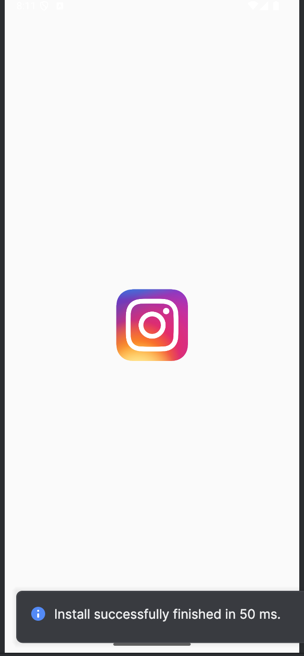
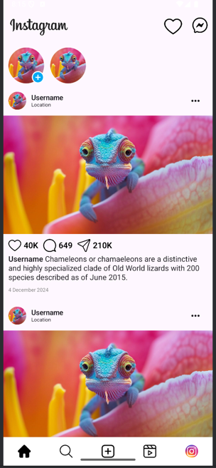
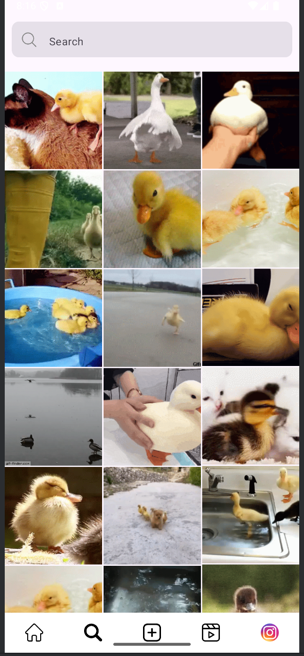
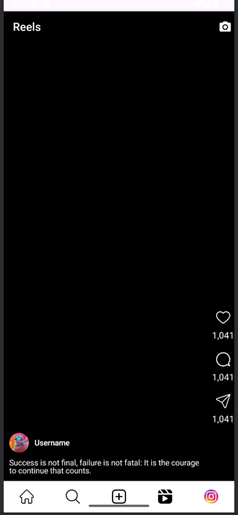
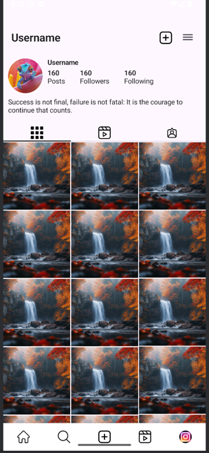

# InstaShare - Instagram Clone with Jetpack Compose

InstaShare is a modern Instagram clone built using **Jetpack Compose**. It features a clean UI and implements various screens, including Splash, Login, Home, Explore, Reels, and Profile. The **Explore** section fetches photos from an API, enhancing user engagement with dynamic content.

## ✨ Features

- **Splash Screen** – Animated splash screen for a smooth startup experience.
- **Login Screen** – User authentication UI.
- **Home Screen** – Displays posts similar to Instagram’s feed.
- **Explore Screen** – Fetches and displays photos dynamically from an API.
- **Reels Screen** – Showcases short video clips.
- **Profile Screen** – Displays user profile with posts and follower info.
- **Jetpack Compose UI** – Fully built using declarative UI principles.
- **API Integration** – Fetches photos dynamically for the Explore section.

## 🛠 Tech Stack

- **Kotlin**
- **Jetpack Compose**
- **Retrofit** (for API calls)
- **Coil** (for image loading)
- **Coroutines & Flow** (for asynchronous operations)
- **Navigation Component** (for seamless screen transitions)
- **MVVM Architecture**

## 🚀 Installation

1. Clone the repository:
   ```sh
   git clone https://github.com/epicureanAshish/Instashare.git
   cd InstaShare
   ```

2. Open the project in **Android Studio** (preferably Arctic Fox or later).

3. Sync dependencies and build the project.

4. Run the app on an emulator or a physical device.

## 🔥 API Integration (Explore Section)

The Explore screen fetches images from an API using **Retrofit**. Ensure you have a working API key (if required) and update the `ApiService.kt` file:

```kotlin
interface ApiService {
    @GET("photos")
    suspend fun getPhotos(): List<Photo>
}
```

## 📸 Screenshots

| Splash | Login | Home |
|--------|-------|------|
|  |  |  |

| Explore | Reels | Profile |
|---------|-------|---------|
|  |  |  |


---

🚀 Happy Coding! 🎨


